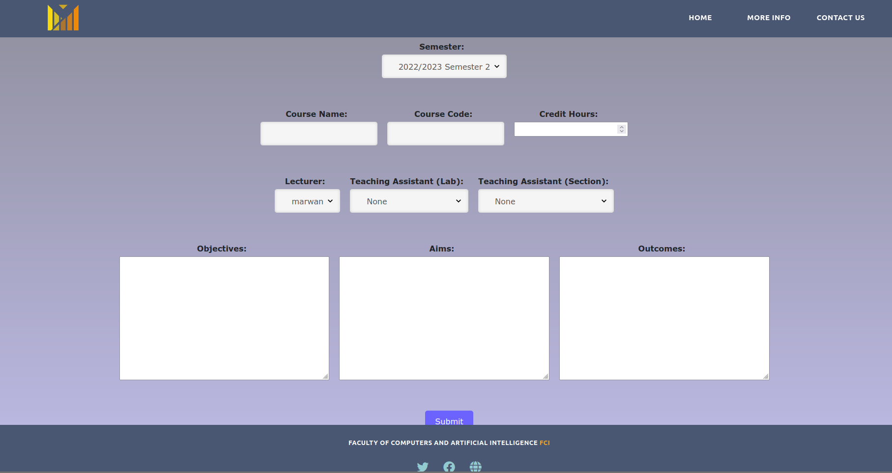
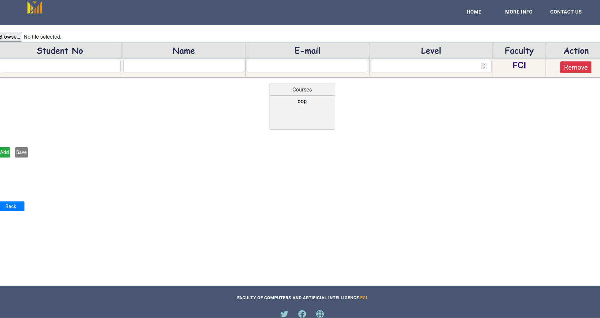
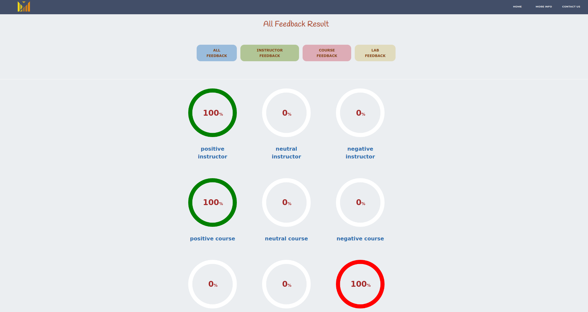
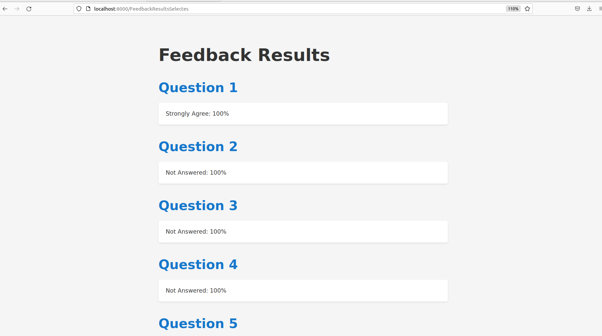
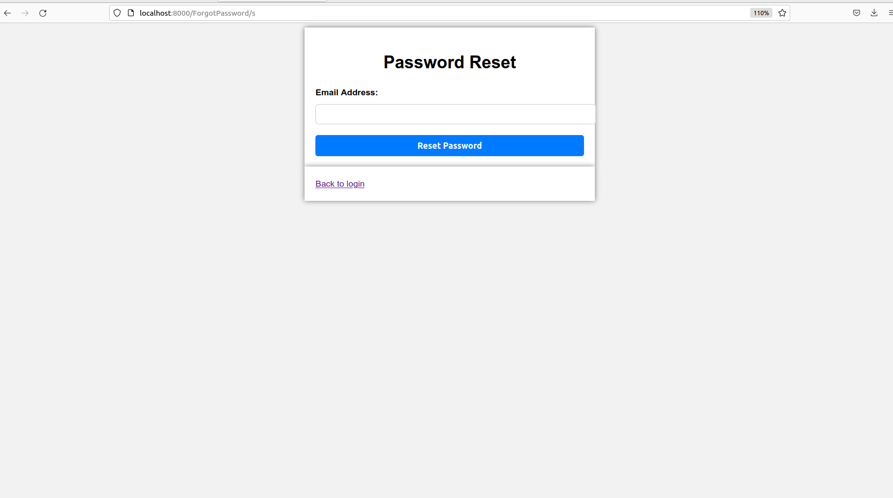
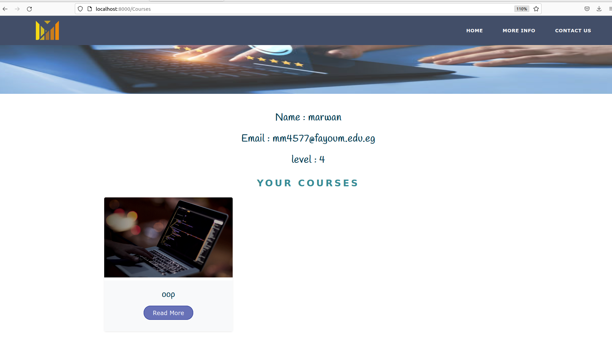
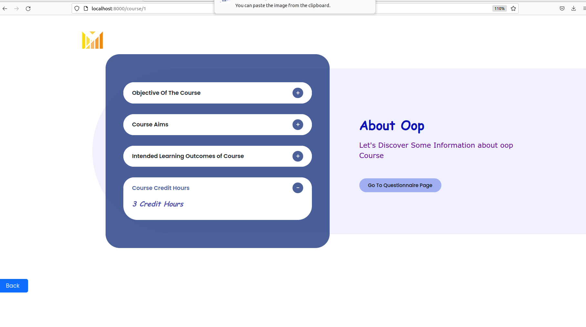
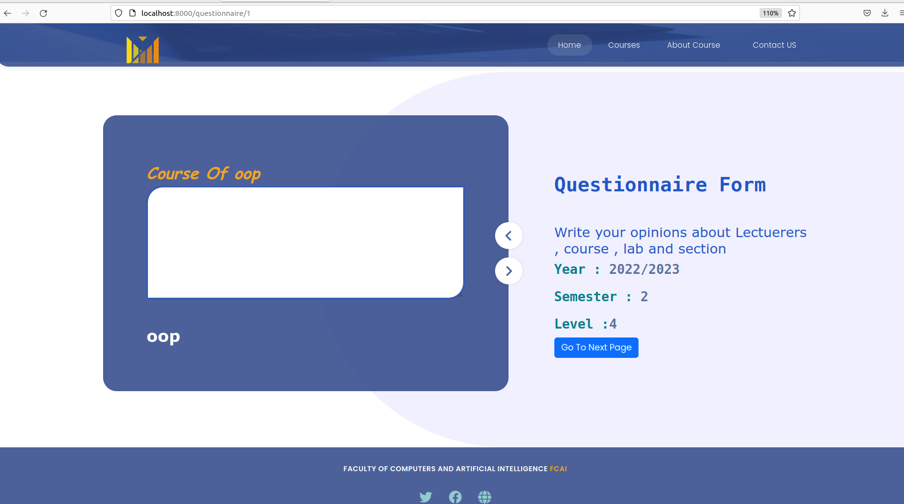
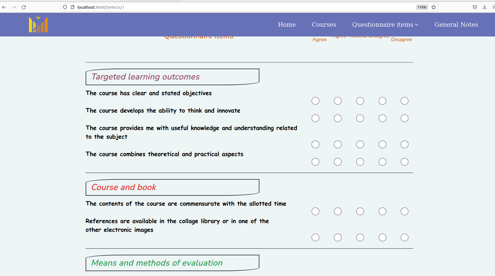

# University Questionnaire System with AI

This Questionnaire system will help the professors and teaching
assistants to solve the problems that the students mentioned in the
survey, and produce higher quality content based on the evaluation and
insights i extracted from the students’ feedback.
The feedback will be collected using 3 different surveys, one for lectures,
and the other two for sections and labs. The students must be enrolled in
this course to provide their feedback.
The insights i provide can be a reliable reference for the Organization
for assessing the performance of each professor and teaching assistant,
and accordingly choose the most suited lecturers for teaching each
course.
I am using Large Language Models to analyze the sentiment of
the provided text, and also summarize all of the feedback per lecture,
section and lab, then provide some insights and visualizations showing
the extracted insights from the feedback.
Aim is to provide accurate, efficient, low cost, scalable and fast Artificial
Intelligence System, and the user can expect to have a system that has
the ability to analyze text in both Arabic and English.

## Install and Running

1. `git clone git@github.com:marwan-kotb/Questionnaire-System-With-AI.git`

2. `cd Questionnaire-System-With-AI`

3. `pip install -r requirements.txt`

4. `python manage.py makemigrations` and `python manage.py makemigrations Questionnaire`

5. `python manage.py migrate` and `python manage.py migrate Questionnaire`

6. `python manage.py createsuperuser`

7. `python manage.py runserver`

- reactivate token.json by email and password that exist in EmailAndPassword.txt

## Demo

### Enjoy ^_^

